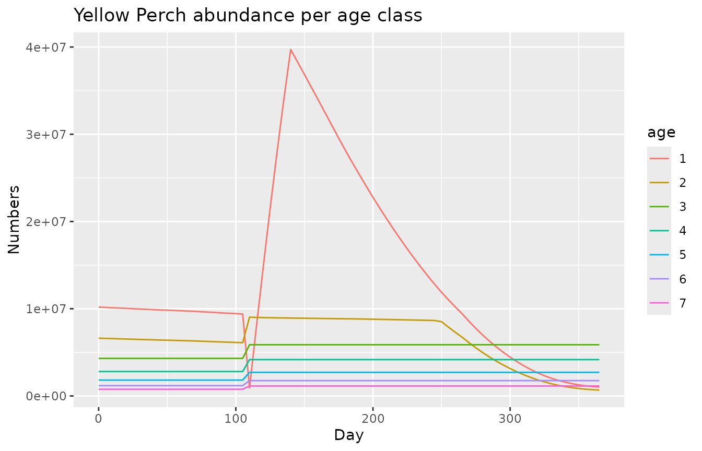
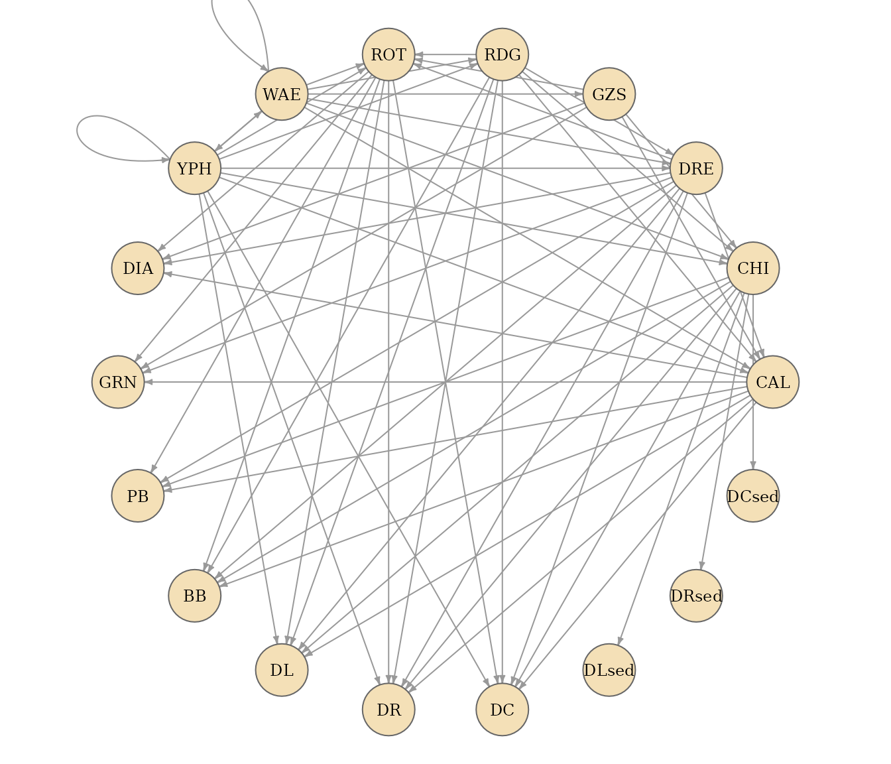

# Get Started with atlantio

``` r

library(atlantio)
```

## Goal

The goal of atlantio is to easily manipulate Atlantis models
([Audzijonyte et al.
2019](#ref-audzijonyte_AtlantisSpatiallyExplicit_2019)). This means
reading, editing and validating Atlantis inputs and outputs (atlantis +
i/o = atlantio).

A major initial objective while working on the package was to be able to
readily set up a semi-automatic calibration of the Lake Erie model using
`calibrar` as described in Morell et al.
([2026](#ref-morell_ManualSemiautomated_2026)).

This vignette is a quick tour of what the package currently does:

1.  build an `Atlantis` object from input and output files,
2.  read and write `.prm` parameter files,
3.  extract time series and biomass tables from model outputs,
4.  derive diet tables and food webs from the biology parameters,
5.  list Atlantis parameters, generate template files and prepare a
    calibration.

## Example files

The package ships with a tiny Atlantis model (inputs and outputs of a
short run). [`atlantis_examples()`](../reference/atlantis_examples.md)
returns the path to these files, so every example below can be run as
is.

``` r

atlantis_examples("inputs") |> list.files()
#>  [1] "tiny_biol.prm"      "tiny_fisheries.csv" "tiny_force.prm"    
#>  [4] "tiny_groups.csv"    "tiny_hydro.nc"      "tiny_init.nc"      
#>  [7] "tiny_physics.prm"   "tiny_run.prm"       "tiny_solar.ts"     
#> [10] "tiny.bgm"
atlantis_examples("outputs") |> list.files()
#>  [1] "export.ts"                   "inputs.ts"                  
#>  [3] "log.txt"                     "output.nc"                  
#>  [5] "outputAgeBiomIndx.txt"       "outputAnnualAgeBiomIndx.txt"
#>  [7] "outputBiomIndx.txt"          "outputBoxBiomass.txt"       
#>  [9] "outputDietCheck.txt"         "outputMigration.txt"        
#> [11] "outputMort.txt"              "outputMortPerPred.txt"      
#> [13] "outputPredPropCheck.txt"     "outputPROD.nc"              
#> [15] "outputSpecificMort.txt"      "outputSpecificPredMort.txt" 
#> [17] "outputSSB.txt"               "outputTOT.nc"               
#> [19] "outputVertSize.txt"          "outputYOY.txt"              
#> [21] "tiny_biol.xml"               "tiny_groups.xml"            
#> [23] "tiny_run.xml"                "tiny.bgm"
```

## Building a model

An `Atlantis` object is a container with one slot per kind of Atlantis
file (geometry, run file, biology parameters, group file, main output,
biomass tables, diet tables, etc.).
[`new_atlantis()`](../reference/new_atlantis.md) creates an empty one
and printing it shows which components are available.

``` r

mod <- new_atlantis()
mod
#> 
#> ── Atlantis Model ──
#> 
#> ── Data availability:
#> ✖ Geometry (BGM)
#> ✖ Run file
#> ✖ Biology parameters
#> ✖ Group file
#> ✖ Main output
#> ✖ Diet data
#> ✖ Detailed diet data
#> ✖ Biomass (system-wide)
#> ✖ Biomass (per box)
#> ✖ Biomass (per age)
```

[`atlantis_load_files()`](../reference/atlantis_load_files.md) reads
files, detects their type from their extension and content, and stores
them in the right slot. Here we add the geometry, the biology
parameters, the group file and the run file.

``` r

mod <- mod |>
  atlantis_load_files(c(
    atlantis_examples("inputs", "tiny.bgm"),
    atlantis_examples("inputs", "tiny_biol.prm"),
    atlantis_examples("inputs", "tiny_groups.csv"),
    atlantis_examples("inputs", "tiny_run.prm")
  ))
#> Warning: 8 Unknown parameters: flagratio_warn, K_max_num_zoning, N_to_C, N_to_P,
#> flag_contam_sanity_check, external_box, trackWind, and flag_contamReprodModel
mod
#> 
#> ── Atlantis Model ──
#> 
#> ── Data availability:
#> ✔ Geometry (BGM)
#> ✔ Run file
#> ✔ Biology parameters
#> ✔ Group file
#> ✖ Main output
#> ✖ Diet data
#> ✖ Detailed diet data
#> ✖ Biomass (system-wide)
#> ✖ Biomass (per box)
#> ✖ Biomass (per age)
#> 
#> ── Group details:
#> • 15 groups
#> • 11 group types
#> • 8 predators
#> 
#> ── Geometry details:
#> • 11 boxes (including 1 boundary box)
#> • mean depth: -30 m
```

Each component is accessible with `@`. The geometry is an `sf` object,
the group file a data frame, and parameter files are named lists.

``` r

mod@geometry[, c("label", "botz", "area")]
#> Simple feature collection with 11 features and 3 fields
#> Geometry type: POLYGON
#> Dimension:     XY
#> Bounding box:  xmin: 94.61386 ymin: -51.15143 xmax: 95.42824 ymax: -50.81279
#> Geodetic CRS:  WGS 84
#> # A tibble: 11 × 4
#>    label  botz      area                                                geometry
#>    <chr> <int>     <int>                                           <POLYGON [°]>
#>  1 Box0    -30 100000000 ((94.61386 -50.97198, 94.73662 -51.00209, 94.77555 -50…
#>  2 Box1    -30 100000000 ((94.73662 -51.00209, 94.85945 -51.03212, 94.89827 -50…
#>  3 Box2    -30 100000000 ((94.85945 -51.03212, 94.98235 -51.06207, 95.02107 -50…
#>  4 Box3    -30 100000000 ((94.98235 -51.06207, 95.10533 -51.09194, 95.14394 -50…
#>  5 Box4    -30 100000000 ((95.10533 -51.09194, 95.22838 -51.12173, 95.26689 -51…
#>  6 Box5    -30 100000000 ((95.22838 -51.12173, 95.35151 -51.15143, 95.38991 -51…
#>  7 Box6    -30 100000000 ((94.77555 -50.90739, 94.89827 -50.93736, 94.93703 -50…
#>  8 Box7    -30 100000000 ((94.89827 -50.93736, 95.02107 -50.96725, 95.05972 -50…
#>  9 Box8    -30 100000000 ((95.02107 -50.96725, 95.14394 -50.99706, 95.18248 -50…
#> 10 Box9    -30 100000000 ((95.14394 -50.99706, 95.26689 -51.02679, 95.30532 -50…
#> 11 Box10   -30 100000000 ((95.26689 -51.02679, 95.38991 -51.05643, 95.42824 -50…
mod@group[, c("Code", "Name", "GroupType", "NumCohorts", "IsPredator")]
#>    Code                Name    GroupType NumCohorts IsPredator
#> 1   WAE             Walleye         FISH          8          1
#> 2   YPH        Yellow_Perch         FISH          7          1
#> 3   GZS        Gizzard_Shad         FISH          5          1
#> 4   RDG          Round_Goby         FISH          5          1
#> 5   DRE          Dressenids    SED_EP_FF          1          1
#> 6   CHI         Chironomids MOB_EP_OTHER          1          1
#> 7   DIA              Diatom       SM_PHY          1          0
#> 8   GRN         Chlorophyta       SM_PHY          1          0
#> 9   CAL            Calanoid      MED_ZOO          1          1
#> 10  ROT     Rotifer_nauplii       SM_ZOO          1          1
#> 11   PB    Pelagic_Bacteria      PL_BACT          1          0
#> 12   BB   Sediment_Bacteria     SED_BACT          1          0
#> 13   DL     Labile_detritus      LAB_DET          1          0
#> 14   DR Refractory_detritus      REF_DET          1          0
#> 15   DC            Carrion3      CARRION          1          0
mod@biology$mum_YPH
#> [1] 0.006924034 0.002932394 0.001700700 0.001329388 0.000991212 0.001092176
#> [7] 0.000405316
#> attr(,"array_length")
#> [1] 7
mod@run$tstop
#> [1] 365
#> attr(,"comments")
#> [1] "day # 1-year run; set 5 day for a quick smoke test"
```

Files can be added at any time, for instance outputs once the model has
been run (see below).

## Reading and writing parameter files

`.prm` files are the main way to configure Atlantis.
[`read_prm()`](../reference/read_prm.md) parses them into a named list
where every entry keeps its comments as an attribute, and
[`write_prm()`](../reference/read_prm.md) does the reverse. This makes
it easy to edit a few parameters programmatically and write a new file.

``` r

prm <- read_prm(atlantis_examples("inputs", "tiny_run.prm"))
length(prm)
#> [1] 82
prm$tstop
#> [1] 365
#> attr(,"comments")
#> [1] "day # 1-year run; set 5 day for a quick smoke test"

prm$tstop <- 730
write_prm(prm[c("tstop", "dt", "toutstart", "toutinc")])
#> tstop 730
#> # hour
#> dt 12
#> # day
#> toutstart 0
#> # day
#> toutinc 5
```

Pass a path to `file` to write to disk instead of the console.

## Working with outputs

Let’s add the main NetCDF output and two biomass tables from the example
run.

``` r

mod <- mod |>
  atlantis_load_files(c(
    atlantis_examples("outputs", "output.nc"),
    atlantis_examples("outputs", "outputBiomIndx.txt"),
    atlantis_examples("outputs", "outputBoxBiomass.txt")
  ))
mod
```

### Biomass tables

[`get_biomass_by_type()`](../reference/get_biomass_by_type.md) returns
one of the biomass tables (`"biomass_all"`, `"biomass_box"`,
`"biomass_age"` or `"biomass_age_annual"`).

``` r

mod |>
  get_biomass_by_type("biomass_all") |>
  dplyr::select(Time, WAE, YPH, GZS, RDG) |>
  head()
#> # A tibble: 6 × 5
#>    Time   WAE   YPH   GZS   RDG
#>   <dbl> <dbl> <dbl> <dbl> <dbl>
#> 1     0 1940. 2281. 6050.  34.3
#> 2     5 1958. 2303. 6138.  35.2
#> 3    10 1976. 2325. 6230.  36.1
#> 4    15 1994. 2348. 6331.  37.0
#> 5    20 2013. 2371. 6443.  38.0
#> 6    25 2032. 2395. 6565.  39.0
```

### Time series from the NetCDF output

[`create_time_series()`](../reference/create_time_series.md) extracts
any variable of the main output as a tidy data frame, optionally
restricted to a set of boxes and layers. Time is in seconds since the
start of the run.

``` r

names(mod@main_output$var) |> head(10)
#>  [1] "volume"     "hdsource"   "hdsink"     "eflux"      "vflux"     
#>  [6] "porosity"   "nominal_dz" "dz"         "topk"       "numlayers"

mod |>
  create_time_series(variable = "Temp", box = 2, layer = 1) |>
  head()
#>      time box layer value variable           units
#> 1       0   2     1    15     Temp degrees Celcius
#> 2  432000   2     1    15     Temp degrees Celcius
#> 3  864000   2     1    15     Temp degrees Celcius
#> 4 1296000   2     1    15     Temp degrees Celcius
#> 5 1728000   2     1    15     Temp degrees Celcius
#> 6 2160000   2     1    15     Temp degrees Celcius
```

[`create_time_series_biomass()`](../reference/create_time_series_biomass.md)
gathers reserve and structural nitrogen, numbers and weight for an
age-structured group, per box, layer and age class.

``` r

ts_yph <- mod |> create_time_series_biomass(group = "YPH")
head(ts_yph)
#> # A tibble: 6 × 10
#>      time   box layer group        age    ResN StructN    Nums    weight units
#>     <dbl> <dbl> <int> <chr>        <chr> <dbl>   <dbl>   <dbl>     <dbl> <chr>
#> 1       0     0     1 Yellow_Perch 1      207.    78.0 308824. 10028845. g    
#> 2  432000     0     1 Yellow_Perch 1      207.    78.0 308824. 10028845. g    
#> 3  864000     0     1 Yellow_Perch 1      207.    78.0 308824. 10028845. g    
#> 4 1296000     0     1 Yellow_Perch 1      207.    78.0 308824. 10028845. g    
#> 5 1728000     0     1 Yellow_Perch 1      207.    78.0 308824. 10028845. g    
#> 6 2160000     0     1 Yellow_Perch 1      207.    78.0 308824. 10028845. g
```

``` r

library(ggplot2)
ts_yph |>
  dplyr::summarise(Nums = sum(Nums), .by = c(time, age)) |>
  ggplot(aes(x = time / 86400, y = Nums, colour = age)) +
  geom_line() +
  labs(x = "Day", y = "Numbers", title = "Yellow Perch abundance per age class")
```



## Diet table and food web

The biology parameter file contains the prey availability matrix
(`pPREY` parameters).
[`create_diet_table()`](../reference/create_diet_table.md) reshapes it
into a prey-by-predator table.

``` r

diet <- create_diet_table(mod)
dim(diet)
#> [1] 20 18
diet[1:6, 1:6]
#>              WAE YPH  GZS RDG DRE  CHI
#> pPREY1GZS1 0.000 0.0 0.00 0.0   0 0.05
#> pPREY2GZS1 0.000 0.0 0.00 0.0   0 0.05
#> pPREY1GZS2 0.000 0.0 0.00 0.0   0 0.00
#> pPREY2GZS2 0.000 0.0 0.00 0.0   0 0.00
#> pPREY1WAE1 0.001 0.1 0.10 0.1   0 0.10
#> pPREY2WAE1 0.000 0.0 0.01 0.0   0 0.10
```

[`create_foodweb()`](../reference/create_foodweb.md) goes one step
further and returns the binary food web as an `igraph` object, ready for
network analysis or plotting.

``` r

fw <- create_foodweb(mod)
fw
#> IGRAPH b7ee483 DNW- 18 62 -- 
#> + attr: name (v/c), weight (e/n)
#> + edges from b7ee483 (vertex names):
#>  [1] WAE->WAE YPH->WAE WAE->YPH YPH->YPH WAE->GZS WAE->RDG YPH->RDG RDG->DRE
#>  [9] WAE->DRE YPH->DRE GZS->CHI RDG->CHI WAE->CHI YPH->CHI CAL->DIA DRE->DIA
#> [17] GZS->DIA ROT->DIA CAL->GRN DRE->GRN GZS->GRN ROT->GRN DRE->CAL GZS->CAL
#> [25] RDG->CAL WAE->CAL YPH->CAL DRE->ROT GZS->ROT RDG->ROT WAE->ROT YPH->ROT
#> [33] CAL->PB  CHI->PB  DRE->PB  ROT->PB  CAL->BB  CHI->BB  DRE->BB  RDG->BB 
#> [41] ROT->BB  CAL->DL  CHI->DL  DRE->DL  RDG->DL  ROT->DL  YPH->DL  CAL->DR 
#> [49] CHI->DR  DRE->DR  RDG->DR  ROT->DR  YPH->DR  CAL->DC  CHI->DC  DRE->DC 
#> [57] RDG->DC  ROT->DC  YPH->DC 
#> + ... omitted several edges
```

``` r

par(mar = c(0, 0, 0, 0))
plot(
  fw,
  layout = igraph::layout_in_circle(fw),
  vertex.size = 16,
  vertex.color = "#f4e0b7",
  vertex.frame.color = "grey40",
  vertex.label.color = "black",
  vertex.label.cex = 0.75,
  edge.color = "grey60",
  edge.arrow.size = 0.3
)
```



## Parameters, templates and calibration

### Listing Atlantis parameters

atlantio embeds a description of Atlantis parameters extracted from the
source code.
[`list_atlantis_parameters()`](../reference/list_atlantis_parameters.md)
returns metadata about the Atlantis version and a list of parameters
with their description, type and where they are read.

``` r

prm_list <- list_atlantis_parameters()
prm_list$meta$atlantis_version
#> [1] 3.6722
length(prm_list$parameters)
#> [1] 686
prm_list$parameters[[1]]
#> $name
#> [1] "include_atmosphere"
#> 
#> $description
#> [1] "Switch enabling the atmospheric exchange concentrations block"
#> 
#> $source_file
#> [1] "physics_prm"
#> 
#> $value_type
#> [1] "int"
#> 
#> $dimension
#> [1] "scalar"
#> 
#> $units
#> NULL
#> 
#> $bm_member
#> [1] "bm->include_atmosphere"
#> 
#> $reader
#> $reader$fn
#> [1] "readkeyprm_i"
#> 
#> $reader$at
#> [1] "atphysics/atphysics.c:229"
#> 
#> $reader$check
#> [1] "none"
#> 
#> 
#> $conditional_on
#> NULL
```

See the [parameter set vignette](parameters/index.md) for a searchable
table.

### Generating template files

[`generate_file()`](../reference/generate_file.md) uses these
descriptions to generate a parameter file with recommended values and
comments. Values that need to be provided by the user are marked with
`<<TO_EDIT>>`. Only the run file is supported for now.

``` r

run_file <- generate_file("run", file = file.path(tempdir(), "run.prm"))
readLines(run_file, n = 12)
#>  [1] "# Generated by atlantio 0.1.2.9000"                                                                   
#>  [2] ""                                                                                                     
#>  [3] "# ========= ContaminantSettings"                                                                      
#>  [4] "track_contaminants 0  \t# Flag to turn on tracking of contaminants.."                                 
#>  [5] ""                                                                                                     
#>  [6] "# ========= DiagnosticOutput"                                                                         
#>  [7] "verbose 0  \t# Detailed logged output"                                                                
#>  [8] "checkbox 0  \t# Give detailed logged output for this box"                                             
#>  [9] "checkstart 0  \t# Start detailed logged output from this day in the model run"                        
#> [10] "checkstop 0  \t# Stop detailed logged output after this day in the model run"                         
#> [11] "fishtest 0  \t# Count up total population for each vertebrate after each main subroutine: 0=no, 1=yes"
#> [12] "flaggape 0  \t# Periodically list prey vs gape statistics (tuning diagnostic)"
```

### Preparing a calibration

[`generate_calibration_table()`](../reference/generate_calibration_table.md)
turns a short YAML specification into the table of parameters to
calibrate expected by `calibrar`: one row per parameter and position,
with bounds, the transformation applied and the file the parameter
belongs to.

``` r

readLines(atlantis_examples("calibrate", "mum.yaml")) |> cat(sep = "\n")
#> - name: mum_<GRP>
#>   GRP: [GZS, RDG, WAE]
#>   min: -6
#>   max: -1
#>   transf: pow10 # exp or pow2
#> - name: mum_<GRP>
#>   GRP: YPH
#>   min: -3
#>   max: -1
#>   transf: pow10 # exp or pow2
#>   position: 2
#>   is_factor: true

mod |>
  generate_calibration_table(atlantis_examples("calibrate", "mum.yaml")) |>
  head()
#>      name   cur_value min max position transf source_file
#> 1 mum_GZS 0.036549944  -6  -1        1  pow10 biology_prm
#> 2 mum_GZS 0.003063438  -6  -1        2  pow10 biology_prm
#> 3 mum_GZS 0.001678270  -6  -1        3  pow10 biology_prm
#> 4 mum_GZS 0.000717670  -6  -1        4  pow10 biology_prm
#> 5 mum_GZS 0.000475500  -6  -1        5  pow10 biology_prm
#> 6 mum_RDG 0.009661128  -6  -1        1  pow10 biology_prm
```

[`transform_parameter_value()`](../reference/transform_parameter_value.md)
and
[`inverse_transform_parameter_value()`](../reference/inverse_transform_parameter_value.md)
map values between the calibration scale and the scale used in the
parameter file.

``` r

transform_parameter_value(-3, "pow10")
#> [1] 0.001
inverse_transform_parameter_value(0.001, "pow10")
#> [1] -3
```

The full workflow (running Atlantis, computing the objective function
and driving `calibrar`) is described in the [calibration
vignette](calibration/index.md).

## References

Audzijonyte, Asta, Heidi Pethybridge, Javier Porobic, Rebecca Gorton,
Isaac Kaplan, and Elizabeth A. Fulton. 2019. “ATLANTIS : A Spatially
Explicit End-to-End Marine Ecosystem Model with Dynamically Integrated
Physics, Ecology and Socio-Economic Modules.” *Methods in Ecology and
Evolution* 10 (10): 1814–19. <https://doi.org/10.1111/2041-210X.13272>.

Morell, Alaia, Isaac C. Kaplan, Hem Nalini Morzaria-Luna, et al. 2026.
“From Manual to Semi-Automated Calibration: A Practical Framework for
Calibrating Atlantis Ecosystem Models.” *Ecological Modelling* 520
(October): 111688. <https://doi.org/10.1016/j.ecolmodel.2026.111688>.
